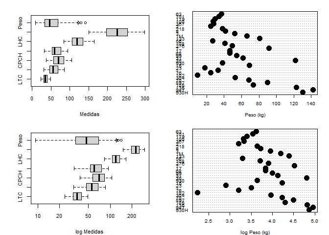
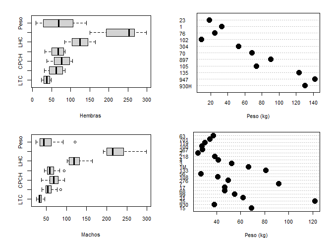
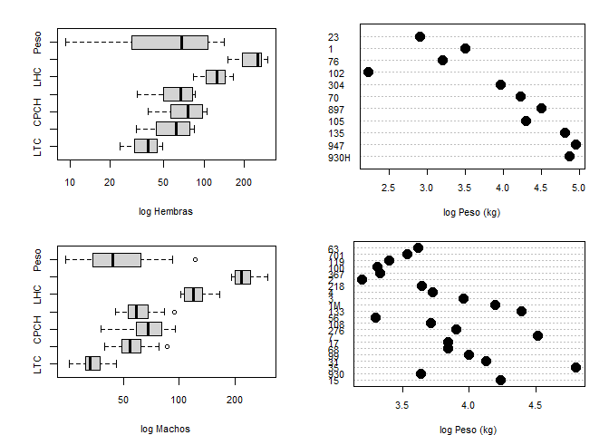
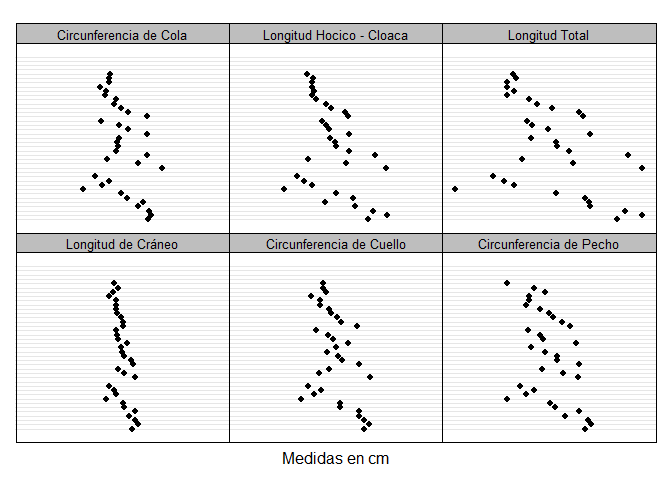
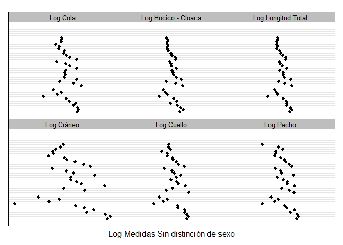
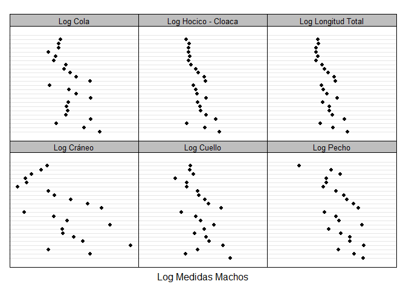
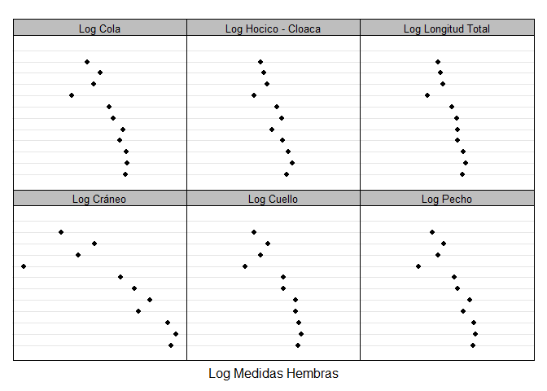

# Tesis de MSc
Aguilera-González, J.F.  
13 de abril de 2017  

### Directorio
Para determinar la ubicación del directorio de trabajo y su contenido es necesario:

  1. Emplear la función `getwd()`   
  2. Visualizar los archivos con `dir()`

```r
getwd()
dir() # Ubicacion de la Base de Datos ("BD.xlsx")
```
### Base de datos
La Base de Datos se almacenó como archivo `.xlsx` (Microsoft Excel 2013) con el nombre `"BD.xlsx"`. 

* El archivo se compone de **tres hojas** de cálculo: 
      + `"BDT"` *Datos Crudos* 
      + `"BDA"` *Datos Hidrométricos e Hidrológicos*
      + `"OUT"` *Datos Atípicos*

* Los encabezados de las **columnas** corresponden a las **variables**
* Cada **observación** se almacenó en una **fila**
* La primer columna corresponde a la identificación **ID** de cada **observación** 

Para visualizar la base de datos se requiere lo siguiente:

  1. Con el **paquete** `readxl` importamos la Base de Datos al entorno de trabajo.
  2. Creamos el **objeto** `dbT <-` que almacena la Base de Datos `"BD.xlsx"`, especifcando la Hoja con `sheet = "BDT"`

### Estructura, dimensión y clase
Para determinar las características del objeto `dbT <-` empleamos:

* Estructura:  `str(dbT)`
* Dimensión:   `dim(dbT)`
* Clase:       `class(dbT)`

### Recodificación
Variables almacenadas como caracteres `chr` las recodificamos a factor creando un nuevo objeto `df <-` con la función `data.table` 


***
## Análisis Exploratorio de Datos (**EDA**)
### 01-fulton-EDA
<!-- --><!-- --><!-- -->

<!-- --><!-- --><!-- --><!-- -->

### 02-fulton-mod


#### Tablas

Estratificación por:
 
  * Estación
  * Clase
  * Sexo

```r
# Tablas ----
t1 <- with(dfK, table(Sexo, Estacion))
t2 <- with(dfK, table(Sexo, Clase))
t3 <- with(dfK, table(Sexo))
require(stargazer)
stargazer(t1, type = "html", summary = F)
```


<table style="text-align:center"><tr><td colspan="4" style="border-bottom: 1px solid black"></td></tr><tr><td style="text-align:left"></td><td>Lluviosa</td><td>Seca</td><td>NA</td></tr>
<tr><td colspan="4" style="border-bottom: 1px solid black"></td></tr><tr><td style="text-align:left">1</td><td>H</td><td>Lluviosa</td><td>6</td></tr>
<tr><td style="text-align:left">2</td><td>M</td><td>Lluviosa</td><td>19</td></tr>
<tr><td style="text-align:left">3</td><td>H</td><td>Seca</td><td>6</td></tr>
<tr><td style="text-align:left">4</td><td>M</td><td>Seca</td><td>5</td></tr>
<tr><td colspan="4" style="border-bottom: 1px solid black"></td></tr></table>


